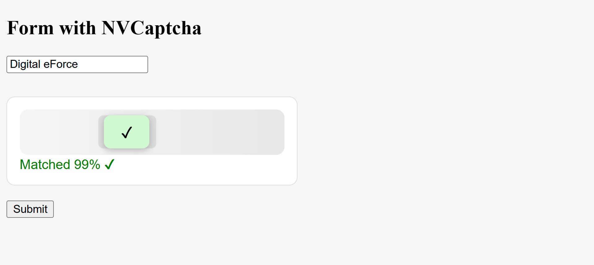

# PHP Slider Captcha

A simple and secure **slider captcha** built with PHP + JavaScript to protect forms from bots and spam.  
This captcha requires users to slide a block into place and verifies how closely it matches the target (with a percentage).  

---

## ✨ Features
- Lightweight, no external dependencies.  
- Shows **match percentage** after verification.  
- Protection with:
  - CSRF-like token
  - Expiry (2 minutes)
  - Honeypot field (bot trap)
  - Attempt limit per session
- Easy to integrate into any PHP form.  

---

## 📂 Repository Structure
```
php-slider-captcha/
│── nvcaptcha/
│   ├── captcha_init.php     # Initializes captcha session & security
│   ├── captcha_view.php     # Captcha UI (slider)
│   ├── captcha_verify.php   # Backend verification (AJAX)
│── example.php              # Example usage form
│── README.md                # Documentation
```

---

## 🚀 Installation
1. Clone the repository:
   ```bash
   git clone https://github.com/DigitalEforce/php-slider-captcha.git
   ```
2. Place the folder in your PHP server (e.g., `htdocs` or `www`).  
3. Open `example.php` in your browser to test.  

---

## 📖 Usage
### Step 1: Include Captcha in Form
```php
<?php include "nvcaptcha/captcha_view.php"; ?>
```

### Step 2: Verify on Submit
```php
if ($_SERVER['REQUEST_METHOD'] === "POST") {
    // Honeypot check
    if (!empty($_POST['nvc_trap'])) {
        die("Bot detected!");
    }
    // Captcha check
    if ($_POST['captcha_verified'] === "1") {
        echo "Form submitted successfully ✅";
    } else {
        echo "Captcha failed ❌";
    }
}
```

---

## 🧪 Example (`example.php`)
```php
<?php session_start(); ?>
<!DOCTYPE html>
<html>
<head><title>Slider Captcha Demo</title></head>
<body>
<h2>Form with Slider Captcha</h2>
<form method="post" action="">
    <input type="text" name="name" placeholder="Your Name" required><br><br>
    <?php include "nvcaptcha/captcha_view.php"; ?><br>
    <button type="submit">Submit</button>
</form>

<?php
if($_SERVER['REQUEST_METHOD'] === "POST"){
    if(!empty($_POST['nvc_trap'])){ die("Bot detected!"); }
    if($_POST['captcha_verified'] === "1"){
        echo "<p style='color:green'>Form submitted successfully ✅</p>";
    } else {
        echo "<p style='color:red'>Captcha failed ❌</p>";
    }
}
?>
</body>
</html>
```

---

## 🖼️ Screenshot

```

```

*(Save your screenshot as `screenshot.png` inside the repo root.)*  

---


---

## 📜 License
MIT License © 2025 [DigitalEforce](https://github.com/DigitalEforce)
